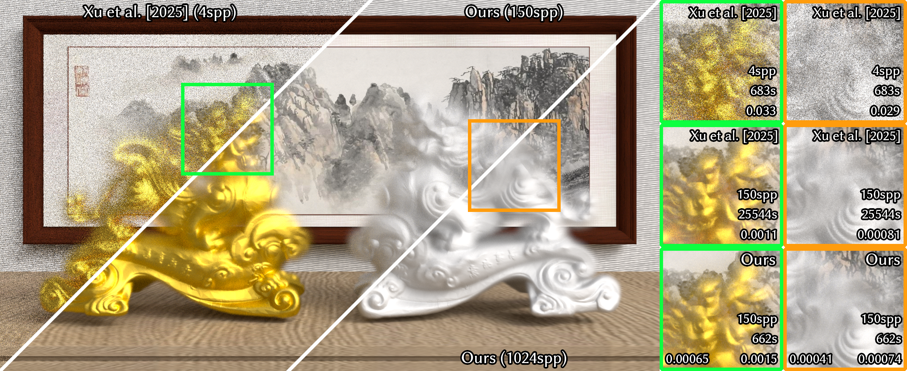

# Macrofacet Theory for Gaussian Process Statistical Surfaces

This repository contains the PBRT-based offline implementation for:

**Macrofacet Theory for Gaussian Process Statistical Surfaces**

Minghao Huang, Yuang Cui, Beibei Wang, Lingqi Yan

## Build

Please refer to [PBRT's README](README_PBRT.md).

## Usage

Our participating media are named as:

* `spheremacrofacet`: For the sphere model.

* `macrofacetvdb`: For any models described in [NanoVDB](https://developer.nvidia.com/nanovdb) format.
